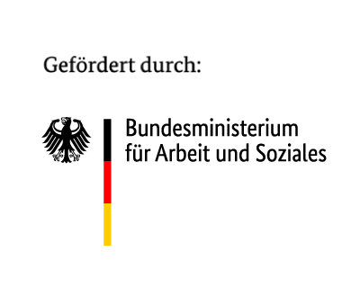
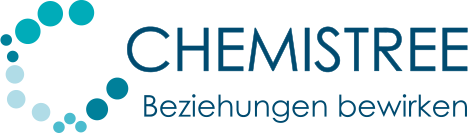

# Project AI Cockpit / KI-Cockpit
In this Github organization you will find technical documentation for the federal German research project AI Cockpit / KI Cockpit. See [project homepage](https://www.kicockpit.eu/) (German) for more details. 

## Contact & Contribution
This project was partly funded by the government of the federal republic of Germany. It is part of a research project aiming to keep _humans in command_ and is organized by the Federal Ministry of Labour and Social Affairs.

# Background & Motivation

## Using, Understanding, and Controlling Artificial Intelligence in the Workplace with Confidence: An AI Cockpit for Employees

Artificial Intelligence (AI) can relieve employees, improve work quality, and increase productivity. A crucial prerequisite for this is that the development, design, and use of the technology are human-centered and closely aligned with the needs and abilities of employees. This also includes enabling employees to understand, monitor, and control AI systems in their daily work. AI is only a meaningful support if decisions about its use and control over its results remain in human hands.

The goal of the AI Cockpit project is to provide employees with an overview of the system’s decisions, empowering them to make well-informed and independent decisions about the necessity of interventions in machine processes. This is intended to minimize societal risks associated with AI technologies, such as biases and discrimination, while increasing acceptance of their use in the workplace. Additionally, a procedural model is being developed to help organizations implement AI systems in compliance with the AI Act.

# Einführung & Motivation

## Künstliche Intelligenz am Arbeitsplatz souverän einsetzen, verstehen und kontrollieren: ein KI-Cockpit für Beschäftigte

Künstliche Intelligenz (KI) kann Beschäftigte entlasten, die Arbeitsqualität verbessern und die Produktivität erhöhen. Eine entscheidende Voraussetzung dafür ist, dass die Entwicklung, Gestaltung und der Einsatz der Technologie menschenzentriert und eng an den Bedürfnissen und Fähigkeiten der Beschäftigten orientiert sind. Dazu gehört auch, dass Beschäftigte KI-Systeme im Arbeitsalltag verstehen, überwachen und steuern können. KI ist nur dann eine sinnvolle Unterstützung, wenn die Entscheidung über ihren Einsatz und die Kontrolle ihrer Ergebnisse beim Menschen liegen. 

Ziel des Projekts KI-Cockpit ist es, Beschäftigten einen Überblick über die Entscheidungen des Systems zu vermitteln und sie damit zu befähigen, gut informiert und selbstständig über die Notwendigkeit von Eingriffen in maschinelle Abläufe zu entscheiden. Damit sollen insbesondere gesellschaftliche Risiken von KI-Technologien wie Verzerrungen und Diskriminierungen minimiert und die Akzeptanz ihrer Nutzung in der Arbeitswelt gesteigert werden. Zudem wird ein Vorgehensmodell entwickelt, das Organisationen bei der AI-Act-konformen Einführung von KI-Systemen unterstützt.

# Software results & projects
In this section all software components developed are being introduced and described. For every component there is guidance where to find more technical information and how you can deploy and use the AI Cockpit variant best suited for your specific needs.

## Human on the loop
 In this section you will find the AI Cockpit "Human on the Loop", which was developed assisting those who are assigned the role of “human oversight” under the AI Act to effectively monitor and control an AI system. It follows a risk based and generic approach.

The features and usecases for this AI Cockpit Human on the Loop are described [here](hol.md).

The software in this section was developed by [Chemistree GmbH](https://www.chemistree.de/)

## Human in the loop
 In this section you will find all components developed to deal with human in the loop scenarios. It is targeted to support operators that need to evaluate and approve AI decisions and actions in time-critical situations. Human intervention thus necessary to address mistakes that have severe consequences. 

All components developed for this application domain are described [here](hil.md).

The software in this section was developed by [Starwit Technologies GmbH](https://starwit-technologies.de/)

## Transparency-Interface

 In this section you will find the template for the Transparency-Interface. The Transparency-Interface (TI) is a guide that enables users to make informed decisions. It provides comprehensible information on the functionality and background of an AI system before and during use.

All components developed for this application domain are described [here](https://github.com/KI-Cockpit/Transparenz-Interface/tree/main).

