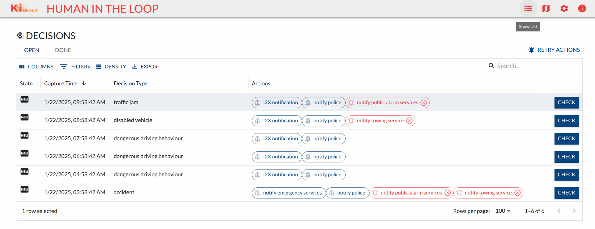
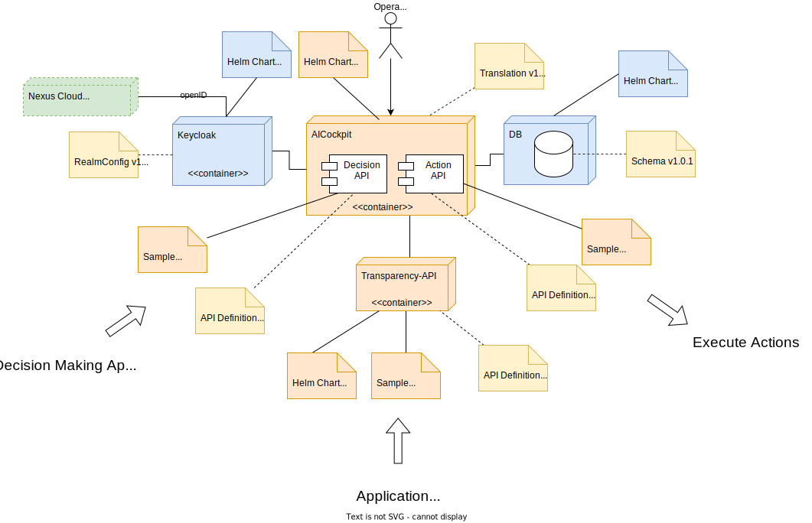

# Project AI Cockpit / KI Cockpit
In this Github organization you will find technical documentation for the federal German researc project AI Cockpit / KI Cockpit. See [project homepage](https://www.kicockpit.eu/) (German) for more details. 

Table of content

* Introduction ([English](#background--motivation) / [Deutsch](#einführung--motivation))
* [Software results & projects](#software-results--projects)

## Contact & Contribution
This project was partly funded by the government of the federal republic of Germany. It is part of a research project aiming to keep _humans in command_ and is organized by the Federal Ministry of Labour and Social Affairs.

# Background & Motivation

## Using, Understanding, and Controlling Artificial Intelligence in the Workplace with Confidence: An AI Cockpit for Employees

Artificial Intelligence (AI) can relieve employees, improve work quality, and increase productivity. A crucial prerequisite for this is that the development, design, and use of the technology are human-centered and closely aligned with the needs and abilities of employees. This also includes enabling employees to understand, monitor, and control AI systems in their daily work. AI is only a meaningful support if decisions about its use and control over its results remain in human hands.

The goal of the AI Cockpit project is to provide employees with an overview of the system’s decisions, empowering them to make well-informed and independent decisions about the necessity of interventions in machine processes. This is intended to minimize societal risks associated with AI technologies, such as biases and discrimination, while increasing acceptance of their use in the workplace. Additionally, a procedural model is being developed to help organizations implement AI systems in compliance with the AI Act.

# Einführung & Motivation

## Künstliche Intelligenz am Arbeitsplatz souverän einsetzen, verstehen und kontrollieren: ein KI-Cockpit für Beschäftigte

Künstliche Intelligenz (KI) kann Beschäftigte entlasten, die Arbeitsqualität verbessern und die Produktivität erhöhen. Eine entscheidende Voraussetzung dafür ist, dass die Entwicklung, Gestaltung und der Einsatz der Technologie menschenzentriert und eng an den Bedürfnissen und Fähigkeiten der Beschäftigten orientiert sind. Dazu gehört auch, dass Beschäftigte KI-Systeme im Arbeitsalltag verstehen, überwachen und steuern können. KI ist nur dann eine sinnvolle Unterstützung, wenn die Entscheidung über ihren Einsatz und die Kontrolle ihrer Ergebnisse beim Menschen liegen. 

Ziel des Projekts KI-Cockpit ist es, Beschäftigten einen Überblick über die Entscheidungen des Systems zu vermitteln und sie damit zu befähigen, gut informiert und selbstständig über die Notwendigkeit von Eingriffen in maschinelle Abläufe zu entscheiden. Damit sollen insbesondere gesellschaftliche Risiken von KI-Technologien wie Verzerrungen und Diskriminierungen minimiert und die Akzeptanz ihrer Nutzung in der Arbeitswelt gesteigert werden. Zudem wird ein Vorgehensmodell entwickelt, das Organisationen bei der AI-Act-konformen Einführung von KI-Systemen unterstützt.

# Software results & projects
In this section all software components developed are being introduced and described. For every component there is guidance where to find more technical information and how you can 

## Field Lab Human Resources

## Field Lab Traffic Control
In this field lab a number of software components were developed and published. Core is a decision/action oriented cockpit application, that focuses on checking/correcting scene interepretation and apropriate action selection/execution. Cockpit is running alongside a number of microservices, that deliver all needed functionality.

All data structures used to integrate Starwit's AI Cockpit into an existing landscape have been standardized int this project and definition can be found [here](https://github.com/KI-Cockpit/ai-cockpit-api). With this abstraction cockpit can be used for many application domains. For a list of examples see [here](https://aic.starwit-infra.de/)

Software in this field lab was developed by [Starwit Technologies GmbH](https://starwit-technologies.de/)

### Introduction
Starwit's AI Cockpit is a web application, based on Java/SpringBoot and ReactJS. The following screenshot shows main cockpit window.

Implementation is based on a scientific [paper](https://ieeexplore.ieee.org/document/844354) that defines foundations of human-machine interactions. Starwit's AI Cockpit focuses on decision making and action execution. This is based on the hypothesis, that human operators will rather understand - and correct - decisions a system has made and actions to be executed. 

### Component Overview
As every modern software system, Starwit's AI Cockpit is not a single component but a composition of a multitude of services. The following table lists all components developed in this project.

| Component       | Repository / URI                                        | Description | Docker image | Helm Chart |
| ----------------| --------------------------------------------------------| ----------- | ------------ |----------- |
| AI Cockpit      | [Link](https://github.com/starwit/ai-cockpit)                   | Actual Cockpit| [Link](https://hub.docker.com/r/starwitorg/ai-cockpit)   | [Link](https://hub.docker.com/r/starwitorg/ai-cockpit-chart) |
| Class library   | [Link](https://github.com/starwit/starwit-aic-api)    | Data structures to use APIs | --   | --   |
| Transparency API| [Link](https://github.com/starwit/starwit-aic-transparency-api) | API for transparency functions, holds module information| [Link](https://hub.docker.com/r/starwitorg/starwit-aicapi-transparency)   | [Link](https://hub.docker.com/r/starwitorg/starwit-aicapi-transparency-chart)   |
| sBOM Generator  | [Link](https://github.com/starwit/sbom-report-generator) | micro service to generate sbom reports| [Link](https://hub.docker.com/r/starwitorg/sbom-generator)   | [Link](https://hub.docker.com/r/starwitorg/sbom-generator-chart)   |
| Landing page    | [Link](https://github.com/starwit/ai-cockpit-landing-page) | Landing page for multiple cockpit deployments | --  | --  |
| AI Cockpit Runner | [Link](https://github.com/starwit/ai-cockpit-runner) | Windows app, that runs Cockpit with selected demo data | --   | --   |
| Alert viewer    | [Link](https://github.com/starwit/alert-viewer) | Web app to display status of action executions | [Link]()   | [Link]()   |
| Action Executor | [Link](https://github.com/starwit/ai-cockpit-action-demo) | Sample action executor, including hardware triggering | [Link](https://hub.docker.com/r/starwitorg/ai-cockpit-action-demo)   | [Link](https://hub.docker.com/r/starwitorg/ai-cockpit-action-demo-chart)   |

### Technical Details
Detailed technical information can be found [here](https://github.com/starwit/ai-cockpit-deployment). However as a brief introduction AI Cockpit is intended to run on modern cloud runtime environments as well as local installations. It is thus assembled as a bundle of services, that can be deployed to [Kubernetes](https://kubernetes.io/). Each component is packaged into a Docker image (see [here](https://hub.docker.com/repositories/starwitorg) for a list) and will be deployed using [Helm](https://helm.sh/).

To provide an overview, how the various artifacts work together, the following picture shows all components necessary to run AI Cockpit.

    
Implementation Artifacts

    

## Field Lab Care Work
