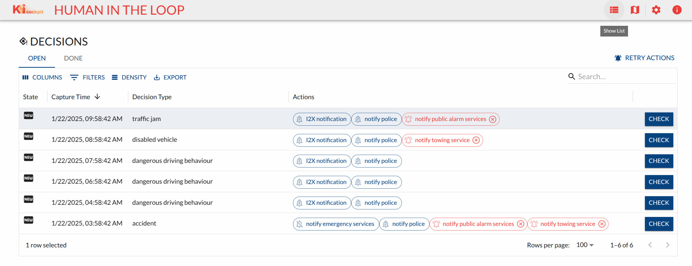
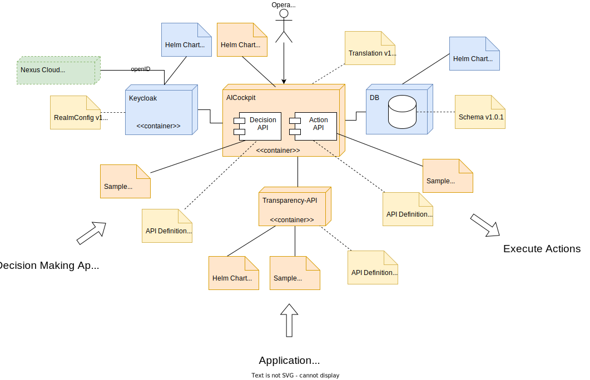

# AI Cockpit - Human in the loop

In this field lab a number of software components were developed and published. Core is a decision/action oriented cockpit application, that focuses on checking/correcting scene interepretation and apropriate action selection/execution. Cockpit is running alongside a number of microservices, that deliver all needed functionality.

All data structures used to integrate Starwit's AI Cockpit into an existing landscape have been standardized int this project and definition can be found [here](https://github.com/KI-Cockpit/ai-cockpit-api). With this abstraction cockpit can be used for many application domains. For a list of examples see [here](https://aic.starwit-infra.de/)

Software in this field lab was developed by [Starwit Technologies GmbH](https://starwit-technologies.de/)

### Solution
Starwit's AI Cockpit is a web application, based on Java/SpringBoot and ReactJS. The following screenshot shows main cockpit window.

Implementation is based on a scientific [paper](https://ieeexplore.ieee.org/document/844354) that defines foundations of human-machine interactions. Starwit's AI Cockpit focuses on decision making and action execution. This is based on the hypothesis, that human operators will rather understand - and correct - decisions a system has made and actions to be executed. 

### Component Overview
As every modern software system, Starwit's AI Cockpit is not a single component but a composition of a multitude of services. The following table lists all components developed in this project.

| Component       | Repository / URI                                        | Description | Docker image | Helm Chart |
| ----------------| --------------------------------------------------------| ----------- | ------------ |----------- |
| AI Cockpit      | [Link](https://github.com/starwit/ai-cockpit)                   | Actual Cockpit| [Link](https://hub.docker.com/r/starwitorg/ai-cockpit)   | [Link](https://hub.docker.com/r/starwitorg/ai-cockpit-chart) |
| Class library   | [Link](https://github.com/starwit/starwit-aic-api)    | Data structures to use APIs | --   | --   |
| Transparency API| [Link](https://github.com/starwit/starwit-aic-transparency-api) | API for transparency functions, holds module information| [Link](https://hub.docker.com/r/starwitorg/starwit-aicapi-transparency)   | [Link](https://hub.docker.com/r/starwitorg/starwit-aicapi-transparency-chart)   |
| sBOM Generator  | [Link](https://github.com/starwit/sbom-report-generator) | micro service to generate sbom reports| [Link](https://hub.docker.com/r/starwitorg/sbom-generator)   | [Link](https://hub.docker.com/r/starwitorg/sbom-generator-chart)   |
| Landing page    | [Link](https://github.com/starwit/ai-cockpit-landing-page) | Landing page for multiple cockpit deployments | --  | --  |
| AI Cockpit Runner | [Link](https://github.com/starwit/ai-cockpit-runner) | Windows app, that runs Cockpit with selected demo data | --   | --   |
| Alert viewer    | [Link](https://github.com/starwit/alert-viewer) | Web app to display status of action executions | [Link]()   | [Link]()   |
| Action Executor | [Link](https://github.com/starwit/ai-cockpit-action-demo) | Sample action executor, including hardware triggering | [Link](https://hub.docker.com/r/starwitorg/ai-cockpit-action-demo)   | [Link](https://hub.docker.com/r/starwitorg/ai-cockpit-action-demo-chart)   |

### Technical Details
Detailed technical information can be found [here](https://github.com/starwit/ai-cockpit-deployment). However as a brief introduction AI Cockpit is intended to run on modern cloud runtime environments as well as local installations. It is thus assembled as a bundle of services, that can be deployed to [Kubernetes](https://kubernetes.io/). Each component is packaged into a Docker image (see [here](https://hub.docker.com/repositories/starwitorg) for a list) and will be deployed using [Helm](https://helm.sh/).

To provide an overview, how the various artifacts work together, the following picture shows all components necessary to run AI Cockpit.
